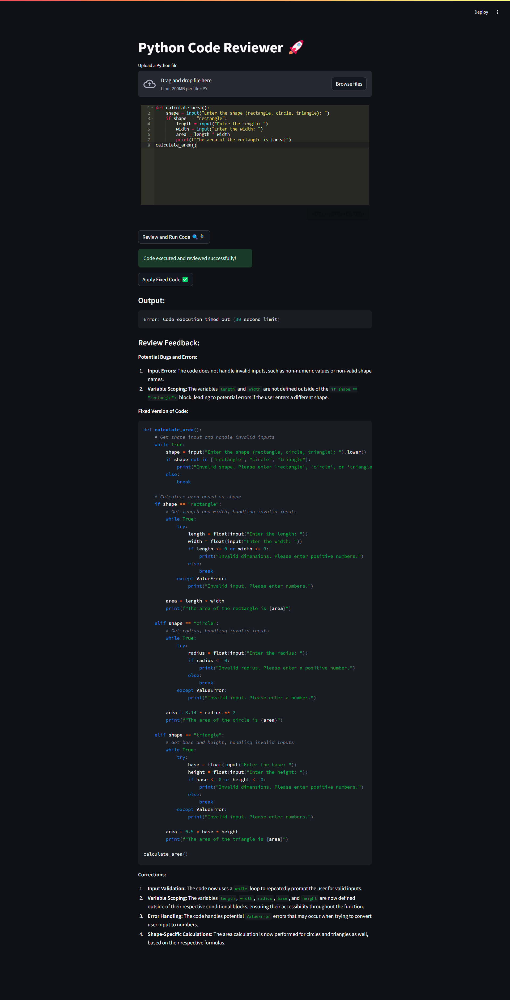

# Python Code Reviewer 🚀

This project is a web-based Python code reviewer application built using Streamlit. It allows users to upload Python code, review it for potential bugs and improvements using the Gemini AI model, and run the code to see its output.

## Features

- **Code Upload**: Upload a Python file to be reviewed and executed.
- **Code Editor**: Edit the uploaded code directly in the web interface.
- **Run Code**: Execute the Python code and capture its output.
- **Review Code**: Send the code to Gemini AI for review and receive feedback.
- **Apply Fixed Code**: Automatically apply the fixed version of the code suggested by the AI.

## Project Structure

```
│
├── Code-Reviewer.py        # Main application script
├── requirements.txt        # List of dependencies
├── README.md               # Project documentation
├── Output.png              # Example output screenshot
└── .env                    # Environment variables (not included in version control)
```

## Installation

1. **Clone the repository**:
    ```sh
    git clone https://github.com/nithish-2003/Innomatics-task02
    cd Innomatics-task02
    ```

2. **Install the required packages**:
    ```sh
    pip install -r requirements.txt
    ```

    The `requirements.txt` file contains the following dependencies:
    ```plaintext
    streamlit
    requests
    google-generativeai
    streamlit_ace
    uuid
    datetime
    ```

3. **Set up environment variables**:
    - Create a `.env` file in the project directory.
    - Add your Gemini API key to the `.env` file:
      ```env
      GEMINI_API_KEY=your_gemini_api_key
      ```

## Obtaining the Gemini API Key

To use the Gemini AI model, you need to obtain an API key. Follow these steps:

1. **Sign up for an account**:
    - Visit the [Console Cloud website](https://console.cloud.google.com/) and sign up for an account.

2. **Generate an API key**:
    - After logging in, navigate to the API section of your account.
    - Generate a new API key and copy it.

3. **Set the API key**:
    - Add the API key to your `.env` file as shown in the installation steps.

## Usage

1. **Run the Streamlit application**:
    ```sh
    streamlit run Code-Reviewer.py
    ```

2. **Upload a Python file**:
    - Use the file uploader to select a Python file from your local machine.

3. **Edit the code**:
    - Use the integrated code editor to make any changes to the uploaded code.

4. **Review and Run the code**:
    - Click the "Review and Run Code" button to execute the code and get a review from the AI.

5. **Apply Fixed Code**:
    - If the AI suggests any fixes, click the "Apply Fixed Code" button to automatically apply the changes.

## Example Output

Below is an example of the output generated by the application:



## Dependencies

- `streamlit`
- `requests`
- `google-generativeai`
- `streamlit_ace`
- `uuid`
- `datetime`
- `python-dotenv`

## Environment Variables

The application requires the following environment variables to be set:

- `GEMINI_API_KEY`: Your Gemini API key for accessing the AI model.

## License

This project is licensed under the MIT License. See the [LICENSE](LICENSE) file for details.

## Acknowledgements

- [Streamlit](https://streamlit.io/)
- [Google Generative AI](https://ai.google/tools/)
- [Streamlit Ace](https://github.com/okld/streamlit-ace)

## Contributing

Contributions are welcome! Please open an issue or submit a pull request for any improvements or bug fixes.

## Contact

For any questions or inquiries, please contact [Nithish] at [nsr631607@gmail.com].

